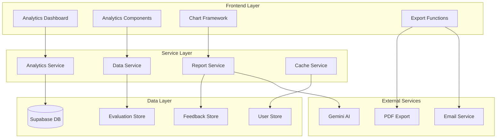

# Analytics Dashboard Design Document

## Overview

The Analytics Dashboard is a comprehensive reporting and insights system for the AI Exam Evaluator platform. It provides multi-role analytics capabilities, enabling teachers, administrators, and institutional stakeholders to monitor evaluation trends, student performance patterns, system usage, and quality metrics through interactive visualizations and automated reports.

The dashboard extends the existing Analytics component with enhanced features including role-based views, advanced filtering, export capabilities, and real-time insights. It integrates seamlessly with the current evaluation pipeline, feedback system, and user management infrastructure.

## Architecture

### System Architecture



### Component Architecture

The dashboard follows a modular component architecture with role-based rendering:

```typescript
// Core dashboard structure
AnalyticsDashboard
├── DashboardHeader (filters, time range, export)
├── RoleBasedView
│   ├── TeacherAnalytics
│   │   ├── StudentPerformanceCharts
│   │   ├── ClassInsights
│   │   └── TeachingRecommendations
│   ├── AdminAnalytics
│   │   ├── SystemMetrics
│   │   ├── UsageStatistics
│   │   └── PerformanceMonitoring
│   └── InstitutionalAnalytics
│       ├── AdoptionMetrics
│       ├── ROIAnalysis
│       └── StakeholderReports
└── ExportModal (PDF, CSV, automated reports)
```

### Data Flow Architecture

1. **Data Collection**: Aggregates data from evaluations, feedback, and user activity
2. **Processing**: Calculates metrics, trends, and insights using analytics service
3. **Caching**: Implements intelligent caching for performance optimization
4. **Visualization**: Renders interactive charts and reports based on user role
5. **Export**: Generates formatted reports for sharing and distribution

## Components and Interfaces

### Core Analytics Service

```typescript
interface AnalyticsService {
  // Teacher Analytics
  getStudentPerformanceData(teacherId: string, filters: AnalyticsFilters): Promise<StudentPerformanceData>
  getClassInsights(teacherId: string, classId?: string): Promise<ClassInsights>
  getTeachingRecommendations(teacherId: string): Promise<TeachingRecommendation[]>
  
  // Admin Analytics
  getSystemMetrics(timeRange: TimeRange): Promise<SystemMetrics>
  getUsageStatistics(filters: UsageFilters): Promise<UsageStatistics>
  getPerformanceMetrics(): Promise<PerformanceMetrics>
  
  // Institutional Analytics
  getAdoptionMetrics(institutionId: string): Promise<AdoptionMetrics>
  getROIAnalysis(institutionId: string, timeRange: TimeRange): Promise<ROIAnalysis>
  generateStakeholderReport(templateId: string, options: ReportOptions): Promise<StakeholderReport>
  
  // Quality Analytics
  getEvaluationAccuracy(): Promise<AccuracyMetrics>
  getConsistencyAnalysis(): Promise<ConsistencyMetrics>
  getAIPerformanceMetrics(): Promise<AIPerformanceMetrics>
  
  // Data Export
  exportAnalyticsData(type: ExportType, filters: AnalyticsFilters): Promise<ExportResult>
  scheduleAutomatedReport(config: AutomatedReportConfig): Promise<ScheduleResult>
}
```

### Data Models

```typescript
interface StudentPerformanceData {
  studentId: string
  studentName: string
  performanceHistory: PerformancePoint[]
  gradeDistribution: GradeDistribution
  subjectAnalysis: SubjectPerformance[]
  improvementTrends: TrendData[]
  riskIndicators: RiskIndicator[]
}

interface ClassInsights {
  classId: string
  totalStudents: number
  averageScore: number
  commonMistakes: CommonMistake[]
  topicPerformance: TopicPerformance[]
  recommendations: TeachingRecommendation[]
  performanceComparison: ComparisonData
}

interface SystemMetrics {
  totalUsers: number
  activeUsers: number
  evaluationVolume: VolumeData
  processingTimes: ProcessingMetrics
  errorRates: ErrorMetrics
  resourceUtilization: ResourceMetrics
}

interface UsageStatistics {
  userActivity: ActivityData[]
  featureUsage: FeatureUsageData
  peakUsageTimes: TimeSlot[]
  geographicDistribution: GeographicData[]
  deviceAnalytics: DeviceData
}

interface AccuracyMetrics {
  overallAccuracy: number
  accuracyByExamType: Record<string, number>
  confidenceScores: ConfidenceData[]
  manualReviewComparison: ComparisonMetrics
  qualityTrends: TrendData[]
}
```

### Chart Components

```typescript
interface ChartComponent {
  // Performance Charts
  PerformanceTrendChart: React.FC<{ data: TrendData[], options: ChartOptions }>
  GradeDistributionChart: React.FC<{ data: GradeDistribution, type: 'pie' | 'bar' }>
  ComparisonChart: React.FC<{ data: ComparisonData[], metrics: string[] }>
  
  // Usage Charts
  UsageHeatmap: React.FC<{ data: UsageData[][], timeRange: TimeRange }>
  VolumeChart: React.FC<{ data: VolumeData[], granularity: 'hour' | 'day' | 'month' }>
  
  // Quality Charts
  AccuracyChart: React.FC<{ data: AccuracyData[], benchmarks: Benchmark[] }>
  ConsistencyChart: React.FC<{ data: ConsistencyData[], thresholds: Threshold[] }>
  
  // Interactive Features
  DrillDownChart: React.FC<{ data: HierarchicalData, onDrillDown: (level: string) => void }>
  FilterableChart: React.FC<{ data: any[], filters: FilterConfig[] }>
}
```

### Export System

```typescript
interface ExportService {
  generatePDFReport(data: AnalyticsData, template: ReportTemplate): Promise<Blob>
  generateCSVExport(data: AnalyticsData, columns: ColumnConfig[]): Promise<Blob>
  generateExcelReport(data: AnalyticsData, sheets: SheetConfig[]): Promise<Blob>
  
  // Automated Reports
  scheduleReport(config: {
    templateId: string
    recipients: string[]
    frequency: 'daily' | 'weekly' | 'monthly'
    filters: AnalyticsFilters
  }): Promise<string>
  
  // Email Integration
  emailReport(reportId: string, recipients: string[], customMessage?: string): Promise<void>
}
```

## Data Models

### Database Schema Extensions

```sql
-- Analytics cache table for performance
CREATE TABLE analytics_cache (
  id UUID PRIMARY KEY DEFAULT gen_random_uuid(),
  cache_key VARCHAR(255) UNIQUE NOT NULL,
  data JSONB NOT NULL,
  expires_at TIMESTAMP WITH TIME ZONE NOT NULL,
  created_at TIMESTAMP WITH TIME ZONE DEFAULT NOW()
);

-- Automated report configurations
CREATE TABLE automated_reports (
  id UUID PRIMARY KEY DEFAULT gen_random_uuid(),
  user_id UUID REFERENCES auth.users(id) ON DELETE CASCADE,
  template_id VARCHAR(100) NOT NULL,
  name VARCHAR(255) NOT NULL,
  recipients TEXT[] NOT NULL,
  frequency VARCHAR(20) NOT NULL CHECK (frequency IN ('daily', 'weekly', 'monthly')),
  filters JSONB NOT NULL DEFAULT '{}',
  is_active BOOLEAN DEFAULT true,
  last_sent_at TIMESTAMP WITH TIME ZONE,
  next_send_at TIMESTAMP WITH TIME ZONE,
  created_at TIMESTAMP WITH TIME ZONE DEFAULT NOW()
);

-- Analytics access log for audit
CREATE TABLE analytics_access_log (
  id UUID PRIMARY KEY DEFAULT gen_random_uuid(),
  user_id UUID REFERENCES auth.users(id) ON DELETE CASCADE,
  view_type VARCHAR(50) NOT NULL,
  filters JSONB,
  accessed_at TIMESTAMP WITH TIME ZONE DEFAULT NOW()
);

-- Performance benchmarks
CREATE TABLE performance_benchmarks (
  id UUID PRIMARY KEY DEFAULT gen_random_uuid(),
  metric_name VARCHAR(100) NOT NULL,
  exam_type VARCHAR(50),
  benchmark_value DECIMAL(10,2) NOT NULL,
  benchmark_type VARCHAR(20) NOT NULL CHECK (benchmark_type IN ('target', 'minimum', 'maximum')),
  is_active BOOLEAN DEFAULT true,
  created_at TIMESTAMP WITH TIME ZONE DEFAULT NOW()
);
```

### Analytics Data Aggregation

```typescript
interface AnalyticsAggregator {
  // Student Performance Aggregation
  aggregateStudentPerformance(studentId: string, timeRange: TimeRange): Promise<StudentPerformanceData>
  
  // Class-level Aggregation
  aggregateClassMetrics(teacherId: string, classId?: string): Promise<ClassMetrics>
  
  // System-wide Aggregation
  aggregateSystemMetrics(timeRange: TimeRange): Promise<SystemMetrics>
  
  // Quality Metrics Aggregation
  aggregateQualityMetrics(timeRange: TimeRange): Promise<QualityMetrics>
  
  // Real-time Metrics
  getRealtimeMetrics(): Promise<RealtimeMetrics>
}
```

## Error Handling

### Error Types and Recovery

```typescript
enum AnalyticsErrorType {
  DATA_UNAVAILABLE = 'data_unavailable',
  INSUFFICIENT_PERMISSIONS = 'insufficient_permissions',
  EXPORT_FAILED = 'export_failed',
  CACHE_MISS = 'cache_miss',
  AGGREGATION_TIMEOUT = 'aggregation_timeout',
  CHART_RENDER_ERROR = 'chart_render_error'
}

interface AnalyticsErrorHandler {
  handleDataUnavailable(error: AnalyticsError): Promise<FallbackData>
  handlePermissionError(error: AnalyticsError): Promise<RestrictedView>
  handleExportError(error: AnalyticsError): Promise<AlternativeFormat>
  handleCacheMiss(error: AnalyticsError): Promise<FreshData>
  handleTimeout(error: AnalyticsError): Promise<PartialData>
  handleRenderError(error: AnalyticsError): Promise<FallbackChart>
}
```

### Graceful Degradation

1. **Data Unavailable**: Show cached data with timestamp warning
2. **Permission Errors**: Display role-appropriate restricted views
3. **Export Failures**: Offer alternative formats or simplified reports
4. **Performance Issues**: Implement progressive loading and data sampling
5. **Chart Errors**: Fallback to table views or simplified visualizations

## Testing Strategy

### Unit Testing

```typescript
describe('AnalyticsService', () => {
  describe('getStudentPerformanceData', () => {
    it('should return performance data for valid student', async () => {
      const mockData = createMockStudentPerformance()
      const result = await analyticsService.getStudentPerformanceData('student-123', {})
      
      expect(result).toMatchObject({
        studentId: 'student-123',
        performanceHistory: expect.any(Array),
        gradeDistribution: expect.any(Object)
      })
    })
    
    it('should handle missing student data gracefully', async () => {
      const result = await analyticsService.getStudentPerformanceData('invalid-id', {})
      expect(result).toBeNull()
    })
  })
  
  describe('generateStakeholderReport', () => {
    it('should generate PDF report with correct template', async () => {
      const report = await analyticsService.generateStakeholderReport('template-1', {})
      expect(report.format).toBe('pdf')
      expect(report.data).toBeDefined()
    })
  })
})
```

### Integration Testing

```typescript
describe('Analytics Dashboard Integration', () => {
  it('should load teacher analytics with proper permissions', async () => {
    const { render, screen } = renderWithAuth(<AnalyticsDashboard />, { role: 'teacher' })
    
    await waitFor(() => {
      expect(screen.getByText('Student Performance')).toBeInTheDocument()
      expect(screen.getByText('Class Insights')).toBeInTheDocument()
    })
  })
  
  it('should restrict admin features for regular users', async () => {
    const { render, screen } = renderWithAuth(<AnalyticsDashboard />, { role: 'user' })
    
    await waitFor(() => {
      expect(screen.queryByText('System Metrics')).not.toBeInTheDocument()
    })
  })
})
```

### Performance Testing

```typescript
describe('Analytics Performance', () => {
  it('should load dashboard within 3 seconds', async () => {
    const startTime = Date.now()
    await analyticsService.getStudentPerformanceData('student-123', {})
    const loadTime = Date.now() - startTime
    
    expect(loadTime).toBeLessThan(3000)
  })
  
  it('should handle large datasets efficiently', async () => {
    const largeDataset = createMockDataset(10000)
    const result = await analyticsService.aggregateClassMetrics('teacher-123')
    
    expect(result).toBeDefined()
    expect(result.totalStudents).toBe(10000)
  })
})
```

### Accessibility Testing

```typescript
describe('Analytics Accessibility', () => {
  it('should be accessible to screen readers', async () => {
    const { container } = render(<AnalyticsDashboard />)
    const results = await axe(container)
    
    expect(results).toHaveNoViolations()
  })
  
  it('should support keyboard navigation', async () => {
    render(<AnalyticsDashboard />)
    
    // Test tab navigation through charts and controls
    fireEvent.keyDown(document.body, { key: 'Tab' })
    expect(screen.getByRole('button', { name: /export/i })).toHaveFocus()
  })
})
```

## Security Considerations

### Data Access Control

```typescript
interface AnalyticsSecurityService {
  validateDataAccess(userId: string, dataType: string, filters: any): Promise<boolean>
  sanitizeAnalyticsData(data: any, userRole: string): any
  auditAnalyticsAccess(userId: string, action: string, data: any): Promise<void>
  enforceRateLimits(userId: string, operation: string): Promise<boolean>
}
```

### Privacy Protection

1. **Data Anonymization**: Remove PII from aggregated analytics
2. **Role-based Filtering**: Restrict data access based on user permissions
3. **Audit Logging**: Track all analytics access for compliance
4. **Data Retention**: Implement automatic cleanup of old analytics data
5. **Export Controls**: Limit export capabilities based on user role

### Performance Optimization

1. **Intelligent Caching**: Cache frequently accessed analytics with TTL
2. **Data Sampling**: Use statistical sampling for large datasets
3. **Progressive Loading**: Load critical metrics first, details on demand
4. **Background Processing**: Pre-calculate common analytics overnight
5. **CDN Integration**: Cache static chart images and reports

## Integration Points

### Existing System Integration

1. **Evaluation Service**: Consumes evaluation data for performance analytics
2. **Feedback Service**: Integrates feedback metrics and quality analysis
3. **User Management**: Leverages role-based permissions and user profiles
4. **AI Service**: Monitors AI performance and accuracy metrics
5. **Export System**: Extends existing PDF generation for reports

### External Service Integration

1. **Email Service**: Automated report delivery via email
2. **Cloud Storage**: Store generated reports and cached data
3. **Monitoring Service**: System health and performance monitoring
4. **Business Intelligence**: Optional integration with BI tools

### API Endpoints

```typescript
// Analytics API endpoints
GET /api/analytics/student-performance/:studentId
GET /api/analytics/class-insights/:teacherId
GET /api/analytics/system-metrics
GET /api/analytics/usage-statistics
POST /api/analytics/export
POST /api/analytics/schedule-report
GET /api/analytics/benchmarks
PUT /api/analytics/benchmarks/:id
```

This design provides a comprehensive foundation for implementing the Analytics Dashboard with proper separation of concerns, scalable architecture, and robust error handling while maintaining security and performance standards.