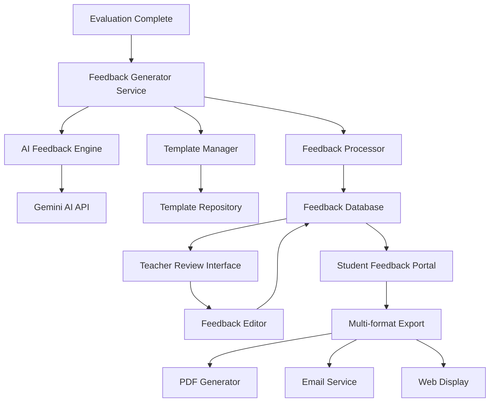

# Design Document

## Overview

The Automated Feedback Generation feature will extend the existing AI Exam Evaluator by adding intelligent, personalized feedback generation capabilities. This system will analyze evaluation results and generate detailed, constructive feedback for students while providing teachers with review and customization tools. The design leverages the existing Gemini AI integration and Supabase backend infrastructure to deliver scalable, consistent feedback generation.

## Architecture

### High-Level Architecture



### System Integration Points

The feedback system integrates with existing components:

- **Evaluation Pipeline**: Hooks into the existing `evaluateExamPaper` function in `src/services/api.ts`
- **AI Service**: Extends current Gemini AI integration for feedback generation
- **Database**: Uses existing Supabase infrastructure with new feedback-related tables
- **UI Components**: Integrates with current React/TypeScript component architecture
- **Authentication**: Leverages existing role-based access control system

## Components and Interfaces

### 1. Feedback Generator Service

**Location**: `src/services/feedbackService.ts`

**Responsibilities**:
- Orchestrate feedback generation process
- Manage feedback templates and configuration
- Handle multi-format output generation

**Key Methods**:
```typescript
interface FeedbackService {
  generateFeedback(evaluationId: string, options?: FeedbackOptions): Promise<FeedbackResult>
  getFeedbackTemplates(examType: string): Promise<FeedbackTemplate[]>
  saveFeedback(feedback: FeedbackData): Promise<string>
  updateFeedback(feedbackId: string, updates: Partial<FeedbackData>): Promise<void>
}
```

### 2. AI Feedback Engine

**Location**: `src/services/aiFeedbackEngine.ts`

**Responsibilities**:
- Generate personalized feedback using Gemini AI
- Apply exam-type specific feedback criteria
- Ensure consistency with evaluation results

**Key Methods**:
```typescript
interface AIFeedbackEngine {
  generatePersonalizedFeedback(evaluation: EvaluationData, template: FeedbackTemplate): Promise<GeneratedFeedback>
  generateClassAnalytics(evaluations: EvaluationData[]): Promise<ClassAnalytics>
  validateFeedbackConsistency(feedback: GeneratedFeedback, evaluation: EvaluationData): ValidationResult
}
```

### 3. Feedback Components

**Location**: `src/components/feedback/`

**Components**:
- `FeedbackGenerator.tsx` - Main feedback generation interface
- `FeedbackEditor.tsx` - Teacher review and editing interface
- `FeedbackViewer.tsx` - Student feedback display
- `FeedbackTemplateManager.tsx` - Admin template configuration
- `ClassAnalytics.tsx` - Aggregate feedback analytics

### 4. Feedback Database Schema

**New Supabase Tables**:

```sql
-- Feedback records
CREATE TABLE feedback (
  id UUID PRIMARY KEY DEFAULT gen_random_uuid(),
  evaluation_id UUID REFERENCES evaluations(id),
  student_id TEXT,
  teacher_id UUID REFERENCES auth.users(id),
  generated_feedback JSONB,
  edited_feedback JSONB,
  status TEXT DEFAULT 'draft',
  created_at TIMESTAMP DEFAULT NOW(),
  updated_at TIMESTAMP DEFAULT NOW()
);

-- Feedback templates
CREATE TABLE feedback_templates (
  id UUID PRIMARY KEY DEFAULT gen_random_uuid(),
  exam_type TEXT,
  template_name TEXT,
  template_content JSONB,
  is_active BOOLEAN DEFAULT true,
  created_by UUID REFERENCES auth.users(id),
  created_at TIMESTAMP DEFAULT NOW()
);

-- Feedback delivery logs
CREATE TABLE feedback_delivery_logs (
  id UUID PRIMARY KEY DEFAULT gen_random_uuid(),
  feedback_id UUID REFERENCES feedback(id),
  delivery_method TEXT,
  recipient_email TEXT,
  delivered_at TIMESTAMP DEFAULT NOW(),
  status TEXT DEFAULT 'sent'
);
```

## Data Models

### Core Feedback Types

```typescript
interface FeedbackData {
  id: string;
  evaluationId: string;
  studentId: string;
  teacherId: string;
  generatedFeedback: GeneratedFeedback;
  editedFeedback?: GeneratedFeedback;
  status: 'draft' | 'reviewed' | 'published';
  createdAt: Date;
  updatedAt: Date;
}

interface GeneratedFeedback {
  overallSummary: FeedbackSummary;
  questionFeedback: QuestionFeedback[];
  recommendations: StudyRecommendation[];
  strengths: string[];
  areasForImprovement: string[];
}

interface FeedbackSummary {
  performance: string;
  grade: string;
  percentile?: number;
  keyAchievements: string[];
  mainConcerns: string[];
}

interface QuestionFeedback {
  questionId: string;
  questionNumber: string;
  feedback: string;
  correctApproach?: string;
  commonMistakes?: string[];
  improvementTips: string[];
}

interface StudyRecommendation {
  topic: string;
  priority: 'high' | 'medium' | 'low';
  resources: string[];
  practiceActivities: string[];
}

interface FeedbackTemplate {
  id: string;
  examType: string;
  templateName: string;
  sections: FeedbackSection[];
  tone: 'formal' | 'encouraging' | 'constructive';
  detailLevel: 'brief' | 'detailed' | 'comprehensive';
}

interface FeedbackSection {
  sectionType: 'summary' | 'question' | 'recommendations' | 'resources';
  template: string;
  required: boolean;
  order: number;
}
```

### Export and Delivery Types

```typescript
interface FeedbackExportOptions {
  format: 'pdf' | 'html' | 'email';
  includeGraphics: boolean;
  includeBranding: boolean;
  customization?: FeedbackCustomization;
}

interface FeedbackCustomization {
  headerText?: string;
  footerText?: string;
  logoUrl?: string;
  colorScheme?: string;
}

interface ClassAnalytics {
  classId: string;
  totalStudents: number;
  averageScore: number;
  commonMistakes: CommonMistake[];
  topicPerformance: TopicPerformance[];
  recommendations: TeachingRecommendation[];
}

interface CommonMistake {
  questionType: string;
  mistake: string;
  frequency: number;
  suggestedIntervention: string;
}
```

## Error Handling

### Feedback Generation Errors

```typescript
enum FeedbackErrorType {
  AI_SERVICE_UNAVAILABLE = 'ai_service_unavailable',
  TEMPLATE_NOT_FOUND = 'template_not_found',
  EVALUATION_NOT_FOUND = 'evaluation_not_found',
  INSUFFICIENT_DATA = 'insufficient_data',
  GENERATION_TIMEOUT = 'generation_timeout',
  VALIDATION_FAILED = 'validation_failed'
}

interface FeedbackError {
  type: FeedbackErrorType;
  message: string;
  details?: Record<string, unknown>;
  retryable: boolean;
}
```

### Error Recovery Strategies

1. **AI Service Failures**: Fallback to template-based feedback generation
2. **Template Issues**: Use default templates with basic feedback structure
3. **Data Validation Errors**: Generate partial feedback with warnings
4. **Export Failures**: Provide alternative formats or simplified versions

## Testing Strategy

### Unit Testing

**Test Coverage Areas**:
- Feedback generation logic
- Template processing
- Data validation
- Export functionality
- Error handling

**Key Test Files**:
- `src/services/__tests__/feedbackService.test.ts`
- `src/services/__tests__/aiFeedbackEngine.test.ts`
- `src/components/feedback/__tests__/FeedbackGenerator.test.tsx`

### Integration Testing

**Test Scenarios**:
- End-to-end feedback generation workflow
- Multi-format export functionality
- Teacher review and editing process
- Student feedback delivery
- Class analytics generation

### Performance Testing

**Performance Targets**:
- Feedback generation: < 30 seconds per evaluation
- PDF export: < 10 seconds per document
- Class analytics: < 60 seconds for 30 students
- Template loading: < 2 seconds

### AI Quality Testing

**Quality Assurance**:
- Feedback consistency across similar evaluations
- Appropriate tone and language for target audience
- Accuracy of recommendations and suggestions
- Alignment with evaluation results

## Security Considerations

### Data Privacy

- Student feedback data encrypted at rest
- Access controls based on teacher-student relationships
- Audit logging for all feedback access and modifications
- GDPR compliance for data retention and deletion

### Access Control

```typescript
interface FeedbackPermissions {
  canGenerate: boolean;
  canEdit: boolean;
  canPublish: boolean;
  canViewAnalytics: boolean;
  canManageTemplates: boolean;
}
```

### API Security

- Rate limiting for feedback generation requests
- Input validation and sanitization
- Secure handling of AI API keys
- Protection against prompt injection attacks

## Performance Optimization

### Caching Strategy

- Template caching with Redis/memory cache
- Generated feedback caching for repeated requests
- Class analytics caching with TTL
- PDF generation result caching

### Batch Processing

- Bulk feedback generation for multiple students
- Asynchronous processing for large classes
- Queue management for high-volume periods
- Progress tracking for long-running operations

### Resource Management

- Connection pooling for database operations
- AI API request throttling and retry logic
- Memory optimization for large document processing
- Cleanup of temporary files and resources

## Monitoring and Analytics

### System Metrics

- Feedback generation success rates
- Average processing times
- AI API usage and costs
- Export format preferences
- User engagement with feedback

### Quality Metrics

- Teacher satisfaction with generated feedback
- Student engagement with feedback content
- Feedback edit frequency and types
- Correlation between feedback and student improvement

### Alerting

- Failed feedback generation alerts
- AI service availability monitoring
- Performance degradation warnings
- High error rate notifications