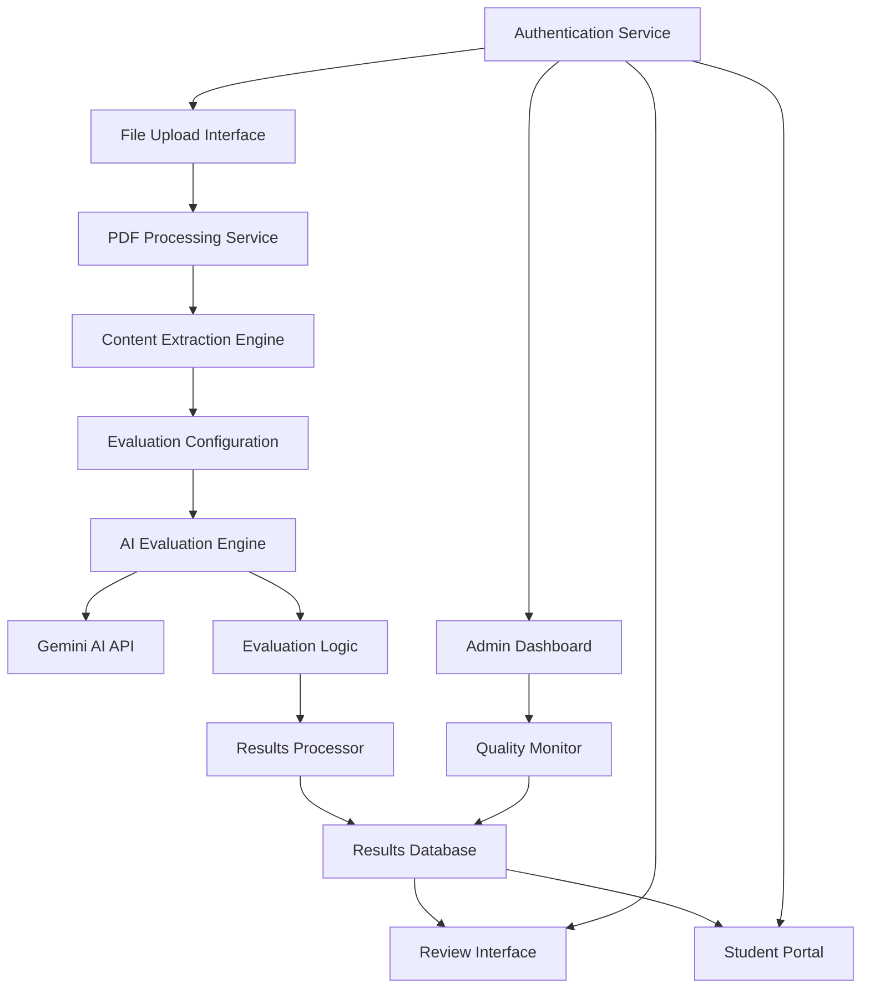

# Design Document

## Overview

The Core Evaluation Engine serves as the heart of the AI Exam Evaluator, orchestrating the entire evaluation workflow from PDF upload to final result generation. The system leverages Google's Gemini AI for intelligent paper assessment while providing robust PDF processing, configurable evaluation parameters, and comprehensive result management. The design emphasizes accuracy, scalability, and user experience across different exam types and educational contexts.

## Architecture

### High-Level System Architecture



### Component Integration

The evaluation engine integrates with existing system components:

- **Frontend**: React components in `src/components/ExamEvaluator.tsx`
- **API Layer**: Service functions in `src/services/api.ts`
- **Database**: Supabase tables for evaluations, results, and configurations
- **Authentication**: Existing Supabase auth with role-based access
- **File Storage**: Supabase storage for PDF files and generated reports

## Components and Interfaces

### 1. PDF Processing Service

**Location**: `src/services/pdfProcessingService.ts`

**Responsibilities**:
- Handle PDF file uploads and validation
- Extract text content from PDF pages
- Manage file storage and retrieval
- Process both exam papers and marking schemes

**Key Methods**:
```typescript
interface PDFProcessingService {
  uploadPDF(file: File, type: 'exam' | 'marking_scheme'): Promise<UploadResult>
  extractContent(fileId: string): Promise<ExtractedContent>
  validatePDF(file: File): Promise<ValidationResult>
  getProcessingStatus(fileId: string): Promise<ProcessingStatus>
}

interface ExtractedContent {
  pages: PageContent[];
  metadata: PDFMetadata;
  extractionQuality: number;
}

interface PageContent {
  pageNumber: number;
  text: string;
  images?: ImageData[];
  tables?: TableData[];
}
```

### 2. Evaluation Configuration Manager

**Location**: `src/services/evaluationConfigService.ts`

**Responsibilities**:
- Manage exam type configurations
- Handle grading scales and criteria
- Store and retrieve evaluation parameters
- Validate configuration settings

**Key Methods**:
```typescript
interface EvaluationConfigService {
  getExamTypeConfig(examType: ExamType): Promise<ExamTypeConfig>
  createEvaluationConfig(config: EvaluationConfig): Promise<string>
  validateConfig(config: EvaluationConfig): ValidationResult
  getGradingScale(examType: ExamType): Promise<GradingScale>
}

interface ExamTypeConfig {
  examType: ExamType;
  defaultCriteria: EvaluationCriteria[];
  gradingScale: GradingScale;
  promptTemplates: PromptTemplate[];
  validationRules: ValidationRule[];
}
```

### 3. AI Evaluation Engine

**Location**: `src/services/aiEvaluationEngine.ts`

**Responsibilities**:
- Interface with Google Gemini AI
- Generate evaluation prompts
- Process AI responses
- Ensure evaluation consistency

**Key Methods**:
```typescript
interface AIEvaluationEngine {
  evaluateExamPaper(
    examContent: ExtractedContent,
    markingScheme: ExtractedContent,
    config: EvaluationConfig
  ): Promise<EvaluationResult>
  
  generateEvaluationPrompt(
    examContent: string,
    markingScheme: string,
    config: EvaluationConfig
  ): string
  
  processAIResponse(response: string): ProcessedEvaluation
  validateEvaluation(evaluation: ProcessedEvaluation): ValidationResult
}
```

### 4. Results Management System

**Location**: `src/services/resultsService.ts`

**Responsibilities**:
- Store and retrieve evaluation results
- Manage result editing and approval workflow
- Handle result sharing and access control
- Generate result reports and exports

**Key Methods**:
```typescript
interface ResultsService {
  saveEvaluationResult(result: EvaluationResult): Promise<string>
  getEvaluationResult(resultId: string): Promise<EvaluationResult>
  updateEvaluationResult(resultId: string, updates: Partial<EvaluationResult>): Promise<void>
  approveEvaluation(resultId: string, teacherId: string): Promise<void>
  getStudentResults(studentId: string): Promise<EvaluationResult[]>
}
```

### 5. Quality Monitoring Service

**Location**: `src/services/qualityMonitorService.ts`

**Responsibilities**:
- Track evaluation accuracy and consistency
- Monitor system performance metrics
- Detect anomalies in evaluation results
- Generate quality reports

**Key Methods**:
```typescript
interface QualityMonitorService {
  trackEvaluationMetrics(evaluation: EvaluationResult): Promise<void>
  detectAnomalies(evaluations: EvaluationResult[]): Promise<Anomaly[]>
  generateQualityReport(timeRange: DateRange): Promise<QualityReport>
  getSystemMetrics(): Promise<SystemMetrics>
}
```

## Data Models

### Core Evaluation Types

```typescript
interface EvaluationResult {
  id: string;
  examPaperId: string;
  markingSchemeid: string;
  studentId: string;
  teacherId: string;
  examType: ExamType;
  configuration: EvaluationConfig;
  
  overallScore: number;
  totalMarks: number;
  percentage: number;
  grade: string;
  
  questionResults: QuestionResult[];
  aiAnalysis: AIAnalysis;
  teacherReview?: TeacherReview;
  
  status: EvaluationStatus;
  createdAt: Date;
  updatedAt: Date;
  approvedAt?: Date;
}

interface QuestionResult {
  questionId: string;
  questionNumber: string;
  maxMarks: number;
  awardedMarks: number;
  studentAnswer: string;
  expectedAnswer: string;
  feedback: string;
  partialCredit?: PartialCreditBreakdown;
}

interface AIAnalysis {
  confidenceScore: number;
  processingTime: number;
  modelVersion: string;
  promptUsed: string;
  rawResponse: string;
  qualityIndicators: QualityIndicator[];
}

interface EvaluationConfig {
  examType: ExamType;
  totalMarks: number;
  passingScore: number;
  gradingScale: GradingScale;
  evaluationCriteria: EvaluationCriteria[];
  customInstructions?: string;
}

type ExamType = 'IELTS' | 'O_LEVEL' | 'A_LEVEL' | 'IGCSE' | 'CUSTOM';
type EvaluationStatus = 'processing' | 'completed' | 'under_review' | 'approved' | 'rejected';
```

### PDF Processing Types

```typescript
interface UploadResult {
  fileId: string;
  fileName: string;
  fileSize: number;
  uploadedAt: Date;
  processingStatus: ProcessingStatus;
}

interface ProcessingStatus {
  status: 'pending' | 'processing' | 'completed' | 'failed';
  progress: number;
  message?: string;
  error?: ProcessingError;
}

interface PDFMetadata {
  pageCount: number;
  fileSize: number;
  creationDate?: Date;
  author?: string;
  title?: string;
  extractionMethod: string;
}
```

### Quality Monitoring Types

```typescript
interface QualityReport {
  timeRange: DateRange;
  totalEvaluations: number;
  averageProcessingTime: number;
  accuracyMetrics: AccuracyMetrics;
  anomalies: Anomaly[];
  systemHealth: SystemHealth;
}

interface AccuracyMetrics {
  averageConfidenceScore: number;
  teacherAgreementRate: number;
  consistencyScore: number;
  errorRate: number;
}

interface Anomaly {
  type: AnomalyType;
  evaluationId: string;
  description: string;
  severity: 'low' | 'medium' | 'high';
  detectedAt: Date;
}

type AnomalyType = 'unusual_score' | 'low_confidence' | 'processing_error' | 'inconsistent_grading';
```

## Database Schema

### Core Tables

```sql
-- Evaluations table
CREATE TABLE evaluations (
  id UUID PRIMARY KEY DEFAULT gen_random_uuid(),
  exam_paper_id UUID REFERENCES uploaded_files(id),
  marking_scheme_id UUID REFERENCES uploaded_files(id),
  student_id TEXT NOT NULL,
  teacher_id UUID REFERENCES auth.users(id),
  exam_type TEXT NOT NULL,
  configuration JSONB NOT NULL,
  status TEXT DEFAULT 'processing',
  created_at TIMESTAMP DEFAULT NOW(),
  updated_at TIMESTAMP DEFAULT NOW()
);

-- Evaluation results table
CREATE TABLE evaluation_results (
  id UUID PRIMARY KEY DEFAULT gen_random_uuid(),
  evaluation_id UUID REFERENCES evaluations(id),
  overall_score DECIMAL NOT NULL,
  total_marks DECIMAL NOT NULL,
  percentage DECIMAL NOT NULL,
  grade TEXT NOT NULL,
  question_results JSONB NOT NULL,
  ai_analysis JSONB NOT NULL,
  teacher_review JSONB,
  approved_at TIMESTAMP,
  created_at TIMESTAMP DEFAULT NOW()
);

-- Uploaded files table
CREATE TABLE uploaded_files (
  id UUID PRIMARY KEY DEFAULT gen_random_uuid(),
  file_name TEXT NOT NULL,
  file_size BIGINT NOT NULL,
  file_type TEXT NOT NULL,
  storage_path TEXT NOT NULL,
  uploaded_by UUID REFERENCES auth.users(id),
  processing_status JSONB DEFAULT '{"status": "pending", "progress": 0}',
  extracted_content JSONB,
  created_at TIMESTAMP DEFAULT NOW()
);

-- Quality metrics table
CREATE TABLE quality_metrics (
  id UUID PRIMARY KEY DEFAULT gen_random_uuid(),
  evaluation_id UUID REFERENCES evaluations(id),
  confidence_score DECIMAL,
  processing_time_ms INTEGER,
  teacher_agreement BOOLEAN,
  anomaly_flags JSONB,
  recorded_at TIMESTAMP DEFAULT NOW()
);
```

## Error Handling

### Error Types and Recovery

```typescript
enum EvaluationErrorType {
  PDF_PROCESSING_FAILED = 'pdf_processing_failed',
  AI_SERVICE_UNAVAILABLE = 'ai_service_unavailable',
  INVALID_CONFIGURATION = 'invalid_configuration',
  CONTENT_EXTRACTION_FAILED = 'content_extraction_failed',
  EVALUATION_TIMEOUT = 'evaluation_timeout',
  INSUFFICIENT_CONTENT = 'insufficient_content'
}

interface EvaluationError {
  type: EvaluationErrorType;
  message: string;
  details: Record<string, unknown>;
  retryable: boolean;
  suggestedAction?: string;
}
```

### Recovery Strategies

1. **PDF Processing Failures**: Retry with different extraction methods, manual upload option
2. **AI Service Issues**: Queue for retry, fallback to template-based evaluation
3. **Configuration Errors**: Validation with helpful error messages, default configurations
4. **Timeout Handling**: Chunked processing, progress indicators, resume capability

## Testing Strategy

### Unit Testing

**Test Coverage Areas**:
- PDF processing and content extraction
- AI prompt generation and response processing
- Evaluation logic and scoring algorithms
- Configuration validation
- Error handling scenarios

**Key Test Files**:
- `src/services/__tests__/pdfProcessingService.test.ts`
- `src/services/__tests__/aiEvaluationEngine.test.ts`
- `src/services/__tests__/resultsService.test.ts`

### Integration Testing

**Test Scenarios**:
- Complete evaluation workflow from upload to results
- Multi-user concurrent evaluations
- Different exam type configurations
- Error recovery and retry mechanisms
- Quality monitoring and anomaly detection

### Performance Testing

**Performance Targets**:
- PDF processing: < 30 seconds for 20-page documents
- AI evaluation: < 2 minutes per exam paper
- Result generation: < 10 seconds
- Concurrent evaluations: Support 10 simultaneous evaluations

### AI Quality Testing

**Quality Assurance**:
- Evaluation consistency across similar papers
- Accuracy validation against known results
- Bias detection in grading patterns
- Prompt effectiveness measurement

## Security and Privacy

### Data Protection

- End-to-end encryption for uploaded files
- Secure storage with access logging
- Automatic data retention policies
- GDPR compliance for student data

### Access Control

```typescript
interface EvaluationPermissions {
  canUpload: boolean;
  canEvaluate: boolean;
  canReview: boolean;
  canApprove: boolean;
  canViewResults: boolean;
  canExportResults: boolean;
}
```

### API Security

- Rate limiting for evaluation requests
- Input validation and sanitization
- Secure file upload with virus scanning
- API key management for AI services

## Performance Optimization

### Caching Strategy

- Configuration caching for exam types
- Template caching for AI prompts
- Result caching for frequently accessed evaluations
- PDF content caching for re-evaluations

### Scalability Considerations

- Horizontal scaling for evaluation processing
- Database connection pooling
- Asynchronous processing for large files
- Load balancing for concurrent users

### Resource Management

- Memory optimization for PDF processing
- AI API usage optimization
- Storage cleanup for temporary files
- Connection management for external services

## Monitoring and Analytics

### System Metrics

- Evaluation processing times
- Success/failure rates
- AI API usage and costs
- User engagement patterns
- System resource utilization

### Business Metrics

- Teacher productivity improvements
- Student result access patterns
- Evaluation accuracy trends
- Feature usage analytics

### Alerting and Notifications

- Failed evaluation alerts
- Performance degradation warnings
- Quality anomaly notifications
- System health monitoring