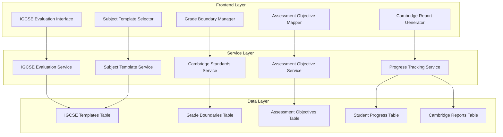

# Design Document - IGCSE Specialized Features

## Overview

The IGCSE Specialized Features extend the AI Exam Evaluator with Cambridge Assessment International Education-specific functionality. This design implements a comprehensive system for IGCSE evaluation standards, subject-specific templates, assessment objective mapping, and Cambridge-compliant reporting. The system integrates seamlessly with the existing evaluation engine while providing specialized IGCSE workflows and data structures.

## Architecture

### High-Level Architecture



### Integration Points

- **Existing Evaluation Service**: Extends current evaluation workflow with IGCSE-specific processing
- **AI Feedback Engine**: Integrates IGCSE assessment objectives into feedback generation
- **Database Layer**: Adds IGCSE-specific tables while maintaining compatibility with existing schema
- **Authentication System**: Leverages existing role-based access control for IGCSE administration

## Components and Interfaces

### 1. IGCSE Evaluation Engine

**Purpose**: Core evaluation logic with Cambridge standards integration

```typescript
interface IGCSEEvaluationEngine {
  evaluateWithIGCSEStandards(
    evaluation: EvaluationData,
    subjectTemplate: IGCSESubjectTemplate,
    gradeBoundaries: IGCSEGradeBoundaries
  ): Promise<IGCSEEvaluationResult>
  
  mapToAssessmentObjectives(
    questionResults: Question[],
    assessmentObjectives: AssessmentObjective[]
  ): AssessmentObjectiveMapping
  
  calculateIGCSEGrade(
    totalMarks: number,
    percentage: number,
    gradeBoundaries: IGCSEGradeBoundaries
  ): IGCSEGrade
}
```

### 2. Subject Template Manager

**Purpose**: Manages IGCSE subject-specific evaluation templates

```typescript
interface IGCSESubjectTemplateManager {
  getTemplatesBySubject(subject: IGCSESubject): Promise<IGCSESubjectTemplate[]>
  createCustomTemplate(template: CreateIGCSETemplateRequest): Promise<IGCSESubjectTemplate>
  updateTemplate(id: string, updates: Partial<IGCSESubjectTemplate>): Promise<IGCSESubjectTemplate>
  validateTemplate(template: IGCSESubjectTemplate): ValidationResult
}
```

### 3. Cambridge Standards Service

**Purpose**: Manages grade boundaries and Cambridge-specific standards

```typescript
interface CambridgeStandardsService {
  getGradeBoundaries(
    subject: IGCSESubject,
    session: string,
    variant?: string
  ): Promise<IGCSEGradeBoundaries>
  
  updateGradeBoundaries(
    boundaries: IGCSEGradeBoundaries,
    adminId: string
  ): Promise<void>
  
  validateCambridgeCompliance(
    evaluation: IGCSEEvaluationResult
  ): ComplianceValidationResult
}
```

### 4. Assessment Objective Mapper

**Purpose**: Maps evaluation results to IGCSE assessment objectives

```typescript
interface AssessmentObjectiveMapper {
  mapQuestionToObjectives(
    question: Question,
    subjectObjectives: AssessmentObjective[]
  ): ObjectiveMapping[]
  
  calculateObjectivePerformance(
    mappings: ObjectiveMapping[],
    totalMarks: number
  ): ObjectivePerformanceReport
  
  generateObjectiveFeedback(
    performance: ObjectivePerformanceReport
  ): ObjectiveFeedback[]
}
```

### 5. Progress Tracking System

**Purpose**: Tracks student progress across examination sessions

```typescript
interface IGCSEProgressTracker {
  recordEvaluationProgress(
    studentId: string,
    evaluation: IGCSEEvaluationResult,
    session: string
  ): Promise<void>
  
  getStudentProgressHistory(
    studentId: string,
    subject?: IGCSESubject
  ): Promise<StudentProgressHistory>
  
  generateProgressReport(
    studentId: string,
    timeframe: ProgressTimeframe
  ): Promise<ProgressReport>
  
  identifyInterventionOpportunities(
    progressHistory: StudentProgressHistory
  ): InterventionRecommendation[]
}
```

## Data Models

### Core IGCSE Types

```typescript
// IGCSE Subject Enumeration
type IGCSESubject = 
  | 'Mathematics'
  | 'English Language'
  | 'English Literature'
  | 'Biology'
  | 'Chemistry'
  | 'Physics'
  | 'Combined Science'
  | 'History'
  | 'Geography'
  | 'Economics'
  | 'Business Studies'
  | 'Computer Science'
  | 'Art & Design'
  | 'Music'
  | 'Physical Education'
  | 'Modern Languages';

// IGCSE Grade System
interface IGCSEGrade {
  grade: 'A*' | 'A' | 'B' | 'C' | 'D' | 'E' | 'F' | 'G' | 'U';
  percentage: number;
  points: number; // For university applications
  description: string;
}

// Grade Boundaries
interface IGCSEGradeBoundaries {
  id: string;
  subject: IGCSESubject;
  session: string; // e.g., "May/June 2024"
  variant?: string; // e.g., "Variant 1"
  boundaries: {
    'A*': number;
    'A': number;
    'B': number;
    'C': number;
    'D': number;
    'E': number;
    'F': number;
    'G': number;
  };
  totalMarks: number;
  updatedAt: string;
  updatedBy: string;
}
```

### Subject Templates

```typescript
interface IGCSESubjectTemplate {
  id: string;
  subject: IGCSESubject;
  templateName: string;
  description: string;
  assessmentObjectives: AssessmentObjective[];
  evaluationCriteria: EvaluationCriteria[];
  markingSchemeGuidelines: string;
  courseworkComponents?: CourseworkComponent[];
  practicalComponents?: PracticalComponent[];
  isActive: boolean;
  createdAt: string;
  updatedAt: string;
  createdBy: string;
}

interface AssessmentObjective {
  code: string; // e.g., "AO1", "AO2", "AO3"
  description: string;
  weighting: number; // Percentage weighting
  skills: string[];
  examples: string[];
}

interface EvaluationCriteria {
  criterion: string;
  description: string;
  markBands: MarkBand[];
}

interface MarkBand {
  range: string; // e.g., "7-8 marks"
  descriptor: string;
  keywords: string[];
}
```

### Evaluation Results

```typescript
interface IGCSEEvaluationResult extends EvaluationResult {
  igcseData: {
    subject: IGCSESubject;
    template: IGCSESubjectTemplate;
    grade: IGCSEGrade;
    gradeBoundaries: IGCSEGradeBoundaries;
    assessmentObjectivePerformance: ObjectivePerformanceReport;
    cambridgeCompliance: ComplianceValidationResult;
    predictedGrade?: IGCSEGrade;
    improvementAreas: ImprovementArea[];
  };
}

interface ObjectivePerformanceReport {
  objectives: {
    [objectiveCode: string]: {
      marksAwarded: number;
      totalMarks: number;
      percentage: number;
      performance: 'Excellent' | 'Good' | 'Satisfactory' | 'Needs Improvement';
      feedback: string;
    };
  };
  overallPerformance: string;
  strengths: string[];
  weaknesses: string[];
}

interface ImprovementArea {
  objective: string;
  priority: 'High' | 'Medium' | 'Low';
  description: string;
  recommendations: string[];
  resources: string[];
}
```

### Progress Tracking

```typescript
interface StudentProgressHistory {
  studentId: string;
  subject: IGCSESubject;
  evaluations: ProgressEvaluation[];
  trends: ProgressTrend[];
  predictions: GradePrediction[];
  interventions: InterventionRecord[];
}

interface ProgressEvaluation {
  evaluationId: string;
  session: string;
  date: string;
  grade: IGCSEGrade;
  percentage: number;
  objectivePerformance: ObjectivePerformanceReport;
  improvementFromPrevious?: number;
}

interface ProgressTrend {
  objective: string;
  trend: 'Improving' | 'Stable' | 'Declining';
  changeRate: number;
  confidence: number;
}

interface GradePrediction {
  predictedGrade: IGCSEGrade;
  confidence: number;
  basedOnSessions: string[];
  factors: string[];
}
```

## Error Handling

### IGCSE-Specific Error Types

```typescript
enum IGCSEErrorCode {
  INVALID_SUBJECT = 'IGCSE_INVALID_SUBJECT',
  TEMPLATE_NOT_FOUND = 'IGCSE_TEMPLATE_NOT_FOUND',
  GRADE_BOUNDARIES_MISSING = 'IGCSE_GRADE_BOUNDARIES_MISSING',
  ASSESSMENT_OBJECTIVE_MAPPING_FAILED = 'IGCSE_AO_MAPPING_FAILED',
  CAMBRIDGE_COMPLIANCE_FAILED = 'IGCSE_COMPLIANCE_FAILED',
  PROGRESS_TRACKING_ERROR = 'IGCSE_PROGRESS_ERROR'
}

interface IGCSEError extends EvaluationError {
  code: IGCSEErrorCode;
  igcseContext?: {
    subject?: IGCSESubject;
    template?: string;
    session?: string;
    objective?: string;
  };
}
```

### Error Recovery Strategies

1. **Template Fallback**: Use default subject template if custom template fails
2. **Grade Boundary Fallback**: Use previous session boundaries if current unavailable
3. **Partial Evaluation**: Continue evaluation with available assessment objectives
4. **Compliance Warnings**: Flag non-compliance issues without blocking evaluation

## Testing Strategy

### Unit Testing

```typescript
describe('IGCSEEvaluationEngine', () => {
  describe('evaluateWithIGCSEStandards', () => {
    it('should apply Cambridge grading standards correctly', async () => {
      const mockEvaluation = createMockEvaluation();
      const mockTemplate = createMockIGCSETemplate();
      const mockBoundaries = createMockGradeBoundaries();
      
      const result = await igcseEngine.evaluateWithIGCSEStandards(
        mockEvaluation,
        mockTemplate,
        mockBoundaries
      );
      
      expect(result.igcseData.grade.grade).toBe('A');
      expect(result.igcseData.cambridgeCompliance.isCompliant).toBe(true);
    });
  });
  
  describe('mapToAssessmentObjectives', () => {
    it('should correctly map questions to assessment objectives', () => {
      const mockQuestions = createMockQuestions();
      const mockObjectives = createMockAssessmentObjectives();
      
      const mapping = igcseEngine.mapToAssessmentObjectives(
        mockQuestions,
        mockObjectives
      );
      
      expect(mapping.objectives).toHaveProperty('AO1');
      expect(mapping.objectives.AO1.percentage).toBeGreaterThan(0);
    });
  });
});
```

### Integration Testing

```typescript
describe('IGCSE Integration Tests', () => {
  it('should complete full IGCSE evaluation workflow', async () => {
    // Test complete workflow from file upload to Cambridge report generation
    const evaluationRequest = createIGCSEEvaluationRequest();
    
    const result = await igcseService.processEvaluation(evaluationRequest);
    
    expect(result.success).toBe(true);
    expect(result.evaluation.igcseData).toBeDefined();
    expect(result.evaluation.igcseData.grade).toBeDefined();
  });
  
  it('should track progress across multiple sessions', async () => {
    const studentId = 'test-student-123';
    const evaluations = await createMultipleEvaluations(studentId);
    
    const progress = await progressTracker.getStudentProgressHistory(studentId);
    
    expect(progress.evaluations).toHaveLength(evaluations.length);
    expect(progress.trends).toBeDefined();
  });
});
```

### Component Testing

```typescript
describe('IGCSE Components', () => {
  describe('IGCSESubjectSelector', () => {
    it('should render all available IGCSE subjects', () => {
      render(<IGCSESubjectSelector onSelect={mockOnSelect} />);
      
      expect(screen.getByText('Mathematics')).toBeInTheDocument();
      expect(screen.getByText('Combined Science')).toBeInTheDocument();
      expect(screen.getByText('English Language')).toBeInTheDocument();
    });
  });
  
  describe('AssessmentObjectiveDisplay', () => {
    it('should display objective performance correctly', () => {
      const mockPerformance = createMockObjectivePerformance();
      
      render(<AssessmentObjectiveDisplay performance={mockPerformance} />);
      
      expect(screen.getByText('AO1: Knowledge and Understanding')).toBeInTheDocument();
      expect(screen.getByText('85%')).toBeInTheDocument();
    });
  });
});
```

## Database Schema Extensions

### New Tables

```sql
-- IGCSE Subject Templates
CREATE TABLE igcse_subject_templates (
  id uuid PRIMARY KEY DEFAULT gen_random_uuid(),
  subject text NOT NULL,
  template_name text NOT NULL,
  description text,
  assessment_objectives jsonb NOT NULL DEFAULT '[]'::jsonb,
  evaluation_criteria jsonb NOT NULL DEFAULT '[]'::jsonb,
  marking_scheme_guidelines text,
  coursework_components jsonb DEFAULT '[]'::jsonb,
  practical_components jsonb DEFAULT '[]'::jsonb,
  is_active boolean DEFAULT true,
  created_at timestamptz DEFAULT now(),
  updated_at timestamptz DEFAULT now(),
  created_by uuid REFERENCES auth.users(id)
);

-- IGCSE Grade Boundaries
CREATE TABLE igcse_grade_boundaries (
  id uuid PRIMARY KEY DEFAULT gen_random_uuid(),
  subject text NOT NULL,
  session text NOT NULL,
  variant text,
  boundaries jsonb NOT NULL,
  total_marks integer NOT NULL,
  created_at timestamptz DEFAULT now(),
  updated_at timestamptz DEFAULT now(),
  updated_by uuid REFERENCES auth.users(id),
  UNIQUE(subject, session, variant)
);

-- Student Progress Tracking
CREATE TABLE igcse_student_progress (
  id uuid PRIMARY KEY DEFAULT gen_random_uuid(),
  student_id text NOT NULL,
  evaluation_id uuid REFERENCES evaluations(id) ON DELETE CASCADE,
  subject text NOT NULL,
  session text NOT NULL,
  grade_data jsonb NOT NULL,
  objective_performance jsonb NOT NULL,
  progress_metrics jsonb DEFAULT '{}'::jsonb,
  created_at timestamptz DEFAULT now()
);

-- Cambridge Reports
CREATE TABLE igcse_cambridge_reports (
  id uuid PRIMARY KEY DEFAULT gen_random_uuid(),
  evaluation_id uuid REFERENCES evaluations(id) ON DELETE CASCADE,
  student_id text NOT NULL,
  subject text NOT NULL,
  report_type text NOT NULL CHECK (report_type IN ('result_statement', 'certificate', 'progress_report')),
  report_data jsonb NOT NULL,
  verification_code text UNIQUE,
  generated_at timestamptz DEFAULT now(),
  generated_by uuid REFERENCES auth.users(id)
);
```

### Indexes for Performance

```sql
-- Indexes for efficient querying
CREATE INDEX idx_igcse_templates_subject ON igcse_subject_templates(subject);
CREATE INDEX idx_igcse_templates_active ON igcse_subject_templates(is_active);
CREATE INDEX idx_igcse_boundaries_subject_session ON igcse_grade_boundaries(subject, session);
CREATE INDEX idx_igcse_progress_student_subject ON igcse_student_progress(student_id, subject);
CREATE INDEX idx_igcse_progress_session ON igcse_student_progress(session);
CREATE INDEX idx_igcse_reports_student ON igcse_cambridge_reports(student_id);
CREATE INDEX idx_igcse_reports_verification ON igcse_cambridge_reports(verification_code);
```

## Security Considerations

### Access Control

1. **Template Management**: Only administrators can create/modify subject templates
2. **Grade Boundaries**: Restricted to Cambridge-certified administrators
3. **Student Data**: GDPR-compliant handling of student progress data
4. **Report Generation**: Secure verification codes for Cambridge reports

### Data Protection

1. **Encryption**: All student data encrypted at rest
2. **Audit Logging**: Complete audit trail for all IGCSE operations
3. **Data Retention**: Configurable retention policies for different data types
4. **Export Controls**: Secure data export with access logging

### Compliance

1. **Cambridge Standards**: Regular validation against official Cambridge guidelines
2. **Data Protection**: GDPR and local education data protection compliance
3. **Academic Integrity**: Secure handling of examination materials
4. **Audit Requirements**: Comprehensive logging for institutional audits

## Performance Optimization

### Caching Strategy

1. **Template Caching**: Cache frequently used subject templates
2. **Grade Boundary Caching**: Cache current session boundaries
3. **Progress Data**: Efficient querying with proper indexing
4. **Report Generation**: Cache generated reports for quick retrieval

### Database Optimization

1. **Partitioning**: Partition progress data by academic year
2. **Archiving**: Archive old evaluation data while maintaining progress history
3. **Query Optimization**: Optimized queries for progress tracking and reporting
4. **Connection Pooling**: Efficient database connection management

This design provides a comprehensive foundation for implementing IGCSE-specialized features while maintaining integration with the existing AI Exam Evaluator system. The modular architecture allows for incremental implementation and future expansion to support additional Cambridge qualifications.