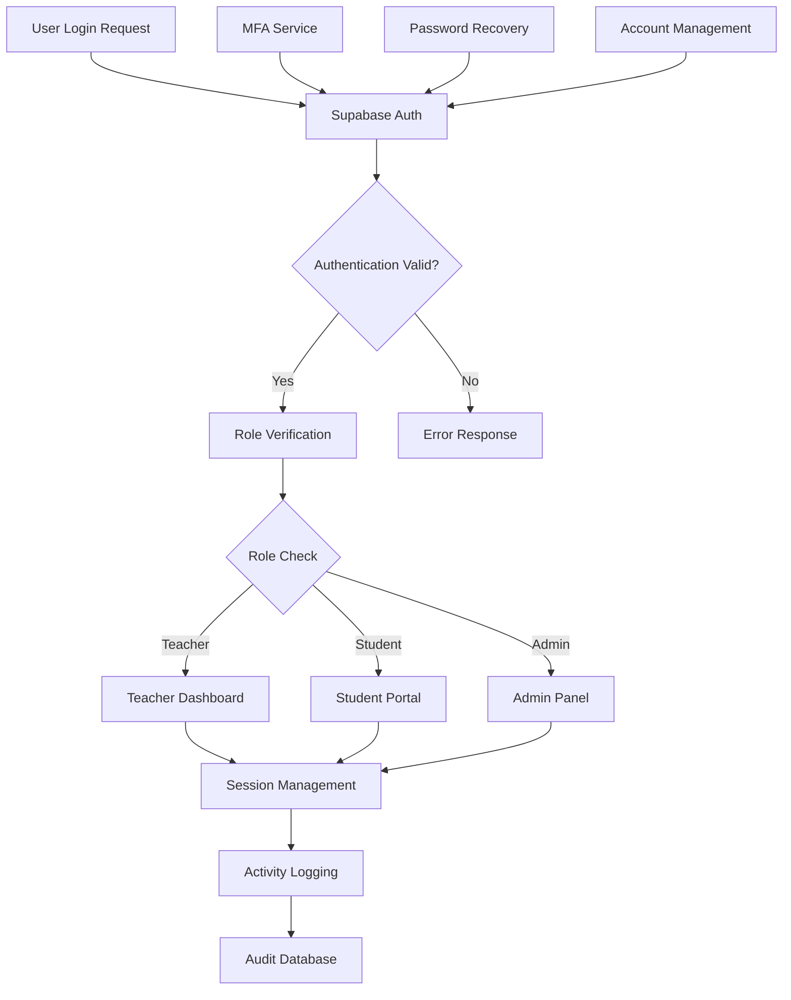

# Design Document

## Overview

The User Authentication System provides comprehensive security and access control for the AI Exam Evaluator application. Built on Supabase's authentication infrastructure, the system implements role-based access control (RBAC), multi-factor authentication, and secure session management. The design emphasizes security best practices while maintaining user experience through seamless authentication flows and intuitive user management interfaces.

## Architecture

### Authentication Flow Architecture



### System Integration Points

The authentication system integrates with:

- **Supabase Auth**: Core authentication service with JWT tokens
- **Database**: User profiles, roles, and permissions stored in PostgreSQL
- **Frontend**: React components with authentication context
- **API Layer**: Protected routes with role-based middleware
- **Audit System**: Comprehensive logging of authentication events

## Components and Interfaces

### 1. Authentication Service

**Location**: `src/services/authService.ts`

**Responsibilities**:
- Handle user registration and login
- Manage authentication tokens and sessions
- Implement MFA workflows
- Coordinate with Supabase Auth

**Key Methods**:
```typescript
interface AuthService {
  signUp(credentials: SignUpCredentials): Promise<AuthResult>
  signIn(credentials: SignInCredentials): Promise<AuthResult>
  signOut(): Promise<void>
  resetPassword(email: string): Promise<void>
  updatePassword(newPassword: string): Promise<void>
  enableMFA(): Promise<MFASetupResult>
  verifyMFA(token: string): Promise<boolean>
  getCurrentUser(): Promise<User | null>
  refreshSession(): Promise<AuthResult>
}
```

### 2. Role Management Service

**Location**: `src/services/roleService.ts`

**Responsibilities**:
- Manage user roles and permissions
- Enforce role-based access control
- Handle role assignments and updates
- Validate user permissions

**Key Methods**:
```typescript
interface RoleService {
  getUserRole(userId: string): Promise<UserRole>
  assignRole(userId: string, role: Role): Promise<void>
  checkPermission(userId: string, permission: Permission): Promise<boolean>
  getRolePermissions(role: Role): Promise<Permission[]>
  updateUserPermissions(userId: string, permissions: Permission[]): Promise<void>
}
```

### 3. User Management Service

**Location**: `src/services/userManagementService.ts`

**Responsibilities**:
- Handle user profile management
- Manage user lifecycle (creation, updates, deactivation)
- Coordinate student-teacher relationships
- Handle bulk user operations

**Key Methods**:
```typescript
interface UserManagementService {
  createUser(userData: CreateUserData): Promise<User>
  updateUser(userId: string, updates: Partial<User>): Promise<User>
  deactivateUser(userId: string): Promise<void>
  getUserProfile(userId: string): Promise<UserProfile>
  getTeacherStudents(teacherId: string): Promise<Student[]>
  assignStudentToTeacher(studentId: string, teacherId: string): Promise<void>
  bulkCreateStudents(studentsData: CreateStudentData[]): Promise<BulkCreateResult>
}
```

### 4. Authentication Components

**Location**: `src/components/auth/`

**Components**:
- `AuthWrapper.tsx` - Main authentication wrapper and context provider
- `LoginForm.tsx` - User login interface
- `SignUpForm.tsx` - User registration interface
- `PasswordReset.tsx` - Password recovery interface
- `MFASetup.tsx` - Multi-factor authentication setup
- `UserProfile.tsx` - User profile management
- `AdminUserManagement.tsx` - Admin user management interface

### 5. Authentication Context

**Location**: `src/contexts/AuthContext.tsx`

**Responsibilities**:
- Provide authentication state throughout the application
- Handle authentication state changes
- Manage user session persistence
- Coordinate authentication-related UI updates

```typescript
interface AuthContextType {
  user: User | null;
  loading: boolean;
  signIn: (credentials: SignInCredentials) => Promise<AuthResult>;
  signUp: (credentials: SignUpCredentials) => Promise<AuthResult>;
  signOut: () => Promise<void>;
  updateProfile: (updates: Partial<UserProfile>) => Promise<void>;
  hasPermission: (permission: Permission) => boolean;
  isRole: (role: Role) => boolean;
}
```

## Data Models

### Core Authentication Types

```typescript
interface User {
  id: string;
  email: string;
  role: Role;
  profile: UserProfile;
  createdAt: Date;
  updatedAt: Date;
  lastLoginAt?: Date;
  isActive: boolean;
  mfaEnabled: boolean;
}

interface UserProfile {
  firstName: string;
  lastName: string;
  institution?: string;
  department?: string;
  studentId?: string;
  phoneNumber?: string;
  avatar?: string;
  preferences: UserPreferences;
}

interface SignUpCredentials {
  email: string;
  password: string;
  firstName: string;
  lastName: string;
  role: Role;
  institution?: string;
  studentId?: string;
  inviteCode?: string;
}

interface SignInCredentials {
  email: string;
  password: string;
  mfaToken?: string;
}

interface AuthResult {
  user: User;
  session: Session;
  error?: AuthError;
}

type Role = 'admin' | 'teacher' | 'student';

interface Permission {
  resource: string;
  action: string;
  conditions?: Record<string, unknown>;
}
```

### Role and Permission System

```typescript
interface RoleDefinition {
  role: Role;
  permissions: Permission[];
  inherits?: Role[];
  description: string;
}

const ROLE_DEFINITIONS: RoleDefinition[] = [
  {
    role: 'admin',
    permissions: [
      { resource: 'users', action: 'create' },
      { resource: 'users', action: 'read' },
      { resource: 'users', action: 'update' },
      { resource: 'users', action: 'delete' },
      { resource: 'evaluations', action: '*' },
      { resource: 'system', action: 'configure' }
    ],
    description: 'Full system access'
  },
  {
    role: 'teacher',
    permissions: [
      { resource: 'evaluations', action: 'create' },
      { resource: 'evaluations', action: 'read', conditions: { owner: true } },
      { resource: 'evaluations', action: 'update', conditions: { owner: true } },
      { resource: 'students', action: 'read', conditions: { assigned: true } },
      { resource: 'results', action: 'publish' }
    ],
    description: 'Teacher access to evaluations and assigned students'
  },
  {
    role: 'student',
    permissions: [
      { resource: 'results', action: 'read', conditions: { owner: true } },
      { resource: 'profile', action: 'update', conditions: { owner: true } }
    ],
    description: 'Student access to own results and profile'
  }
];
```

### Session and Security Types

```typescript
interface Session {
  accessToken: string;
  refreshToken: string;
  expiresAt: Date;
  user: User;
}

interface MFASetupResult {
  secret: string;
  qrCode: string;
  backupCodes: string[];
}

interface AuthError {
  code: string;
  message: string;
  details?: Record<string, unknown>;
}

interface AuditLog {
  id: string;
  userId: string;
  action: string;
  resource: string;
  ipAddress: string;
  userAgent: string;
  timestamp: Date;
  success: boolean;
  details?: Record<string, unknown>;
}
```

## Database Schema

### Authentication Tables

```sql
-- User profiles table (extends Supabase auth.users)
CREATE TABLE user_profiles (
  id UUID PRIMARY KEY REFERENCES auth.users(id),
  first_name TEXT NOT NULL,
  last_name TEXT NOT NULL,
  role TEXT NOT NULL CHECK (role IN ('admin', 'teacher', 'student')),
  institution TEXT,
  department TEXT,
  student_id TEXT,
  phone_number TEXT,
  avatar_url TEXT,
  preferences JSONB DEFAULT '{}',
  is_active BOOLEAN DEFAULT true,
  mfa_enabled BOOLEAN DEFAULT false,
  created_at TIMESTAMP DEFAULT NOW(),
  updated_at TIMESTAMP DEFAULT NOW()
);

-- Role permissions table
CREATE TABLE role_permissions (
  id UUID PRIMARY KEY DEFAULT gen_random_uuid(),
  role TEXT NOT NULL,
  resource TEXT NOT NULL,
  action TEXT NOT NULL,
  conditions JSONB,
  created_at TIMESTAMP DEFAULT NOW()
);

-- User permissions (for custom permissions beyond role)
CREATE TABLE user_permissions (
  id UUID PRIMARY KEY DEFAULT gen_random_uuid(),
  user_id UUID REFERENCES auth.users(id),
  resource TEXT NOT NULL,
  action TEXT NOT NULL,
  conditions JSONB,
  granted_by UUID REFERENCES auth.users(id),
  granted_at TIMESTAMP DEFAULT NOW(),
  expires_at TIMESTAMP
);

-- Teacher-student relationships
CREATE TABLE teacher_students (
  id UUID PRIMARY KEY DEFAULT gen_random_uuid(),
  teacher_id UUID REFERENCES auth.users(id),
  student_id UUID REFERENCES auth.users(id),
  assigned_at TIMESTAMP DEFAULT NOW(),
  assigned_by UUID REFERENCES auth.users(id),
  is_active BOOLEAN DEFAULT true,
  UNIQUE(teacher_id, student_id)
);

-- Authentication audit logs
CREATE TABLE auth_audit_logs (
  id UUID PRIMARY KEY DEFAULT gen_random_uuid(),
  user_id UUID REFERENCES auth.users(id),
  action TEXT NOT NULL,
  resource TEXT,
  ip_address INET,
  user_agent TEXT,
  success BOOLEAN NOT NULL,
  error_message TEXT,
  details JSONB,
  timestamp TIMESTAMP DEFAULT NOW()
);

-- MFA backup codes
CREATE TABLE mfa_backup_codes (
  id UUID PRIMARY KEY DEFAULT gen_random_uuid(),
  user_id UUID REFERENCES auth.users(id),
  code_hash TEXT NOT NULL,
  used_at TIMESTAMP,
  created_at TIMESTAMP DEFAULT NOW()
);
```

### Row Level Security Policies

```sql
-- User profiles RLS
ALTER TABLE user_profiles ENABLE ROW LEVEL SECURITY;

CREATE POLICY "Users can view own profile" ON user_profiles
  FOR SELECT USING (auth.uid() = id);

CREATE POLICY "Users can update own profile" ON user_profiles
  FOR UPDATE USING (auth.uid() = id);

CREATE POLICY "Admins can view all profiles" ON user_profiles
  FOR SELECT USING (
    EXISTS (
      SELECT 1 FROM user_profiles 
      WHERE id = auth.uid() AND role = 'admin'
    )
  );

-- Teacher-student relationships RLS
ALTER TABLE teacher_students ENABLE ROW LEVEL SECURITY;

CREATE POLICY "Teachers can view their students" ON teacher_students
  FOR SELECT USING (teacher_id = auth.uid());

CREATE POLICY "Students can view their teachers" ON teacher_students
  FOR SELECT USING (student_id = auth.uid());
```

## Security Implementation

### Password Security

```typescript
interface PasswordPolicy {
  minLength: number;
  requireUppercase: boolean;
  requireLowercase: boolean;
  requireNumbers: boolean;
  requireSpecialChars: boolean;
  preventReuse: number;
  maxAge: number; // days
}

const DEFAULT_PASSWORD_POLICY: PasswordPolicy = {
  minLength: 8,
  requireUppercase: true,
  requireLowercase: true,
  requireNumbers: true,
  requireSpecialChars: true,
  preventReuse: 5,
  maxAge: 90
};
```

### Session Security

```typescript
interface SessionConfig {
  accessTokenTTL: number; // minutes
  refreshTokenTTL: number; // days
  maxConcurrentSessions: number;
  requireMFAForSensitiveActions: boolean;
  sessionTimeoutWarning: number; // minutes before expiry
}

const SESSION_CONFIG: SessionConfig = {
  accessTokenTTL: 60,
  refreshTokenTTL: 30,
  maxConcurrentSessions: 3,
  requireMFAForSensitiveActions: true,
  sessionTimeoutWarning: 5
};
```

### Rate Limiting

```typescript
interface RateLimitConfig {
  loginAttempts: {
    maxAttempts: number;
    windowMinutes: number;
    lockoutMinutes: number;
  };
  passwordReset: {
    maxRequests: number;
    windowMinutes: number;
  };
  mfaAttempts: {
    maxAttempts: number;
    windowMinutes: number;
  };
}
```

## Error Handling

### Authentication Error Types

```typescript
enum AuthErrorType {
  INVALID_CREDENTIALS = 'invalid_credentials',
  ACCOUNT_LOCKED = 'account_locked',
  ACCOUNT_DISABLED = 'account_disabled',
  MFA_REQUIRED = 'mfa_required',
  MFA_INVALID = 'mfa_invalid',
  SESSION_EXPIRED = 'session_expired',
  INSUFFICIENT_PERMISSIONS = 'insufficient_permissions',
  RATE_LIMITED = 'rate_limited',
  WEAK_PASSWORD = 'weak_password',
  EMAIL_NOT_VERIFIED = 'email_not_verified'
}

interface AuthErrorHandler {
  handleError(error: AuthError): Promise<AuthErrorResponse>;
  getRecoveryOptions(error: AuthError): RecoveryOption[];
}
```

## Testing Strategy

### Unit Testing

**Test Coverage Areas**:
- Authentication service methods
- Role and permission validation
- Password policy enforcement
- MFA setup and verification
- Session management

**Key Test Files**:
- `src/services/__tests__/authService.test.ts`
- `src/services/__tests__/roleService.test.ts`
- `src/components/auth/__tests__/LoginForm.test.tsx`

### Integration Testing

**Test Scenarios**:
- Complete authentication flows
- Role-based access control
- Multi-factor authentication workflows
- Password recovery processes
- Session timeout and refresh

### Security Testing

**Security Test Areas**:
- SQL injection prevention
- XSS protection
- CSRF token validation
- Rate limiting effectiveness
- Session hijacking prevention

## Performance Considerations

### Optimization Strategies

- JWT token caching for permission checks
- Role permission caching with TTL
- Database connection pooling
- Lazy loading of user profiles
- Efficient audit log storage

### Scalability Planning

- Horizontal scaling for authentication services
- Database sharding for large user bases
- CDN integration for static authentication assets
- Load balancing for high-traffic periods

## Monitoring and Analytics

### Authentication Metrics

- Login success/failure rates
- MFA adoption rates
- Password reset frequency
- Session duration analytics
- Role distribution statistics

### Security Monitoring

- Failed login attempt patterns
- Suspicious activity detection
- Account lockout frequency
- Permission escalation attempts
- Audit log analysis

### Alerting System

- Multiple failed login alerts
- Account lockout notifications
- Suspicious activity warnings
- System availability alerts
- Performance degradation notices